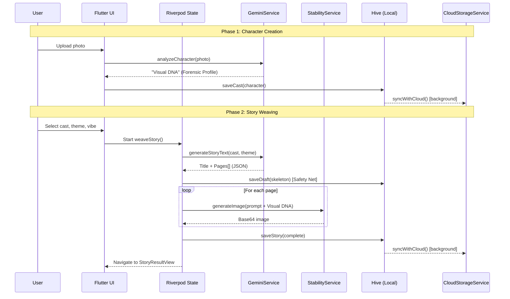

# Tellulu Technical Design Document

> [!NOTE]
> **Status:** Living Document  
> **App:** Tellulu (Flutter + GenAI Storytelling)  
> **Last Updated:** Feb 22, 2026  
> **Version:** 1.2.0

## 1. Executive Summary

Tellulu is a cross-platform (Mobile + Web) storytelling application built with **Flutter 3.38**. It empowers children (ages 3-8) to create personalized, illustrated storybooks by combining user-uploaded character photos with AI-generated narratives and artwork. The app is designed for parents and kids to use together.

**Core Technology:** The text pipeline uses **Google Gemini** (REST API) for story plotting, character analysis, and natural language generation. The image pipeline uses **Stability AI (SDXL)** for high-fidelity illustration generation, with a **Firebase Cloud Function** proxy for web CORS.

**Key Architectural Bets:**
- **Local-First Storage** (Hive) — user data never leaves the device unless they opt into cloud sync
- **Visual Consistency Engine** — character identity is maintained across scenes via "Visual DNA" prompt injection
- **Raw HTTP over SDKs** — full control over auth, retries, and response parsing (see ADRs in §4.2)

**Maturity:** V1 in production on web (`tellulu.web.app`). 27 automated tests, 6 Architectural Decision Records, and a self-audited 92% design-to-code alignment score (see §A5).

### Changelog

| Date | Version | Changes |
|---|---|---|
| Feb 22, 2026 | 1.2.0 | Added Version Control & Repository section (§8.4), GitHub remote configured, release tag `v1.2.0` created |
| Feb 19, 2026 | 1.2.0 | Alignment assessment (§A5), 6 ADRs added (§3.2, §4.2, §9, §A3), expanded vibe table to 20 entries, Completer init lock promoted to §6.1, A1/A2 extracted to `docs/guides/` |
| Feb 19, 2026 | 1.1.3 | Code quality audit (§A4): 23 findings addressed, security hardening, typed exceptions, shared utilities |
| Jan 2026 | 1.0.3 | Data safety audit (§A3): user-scoped boxes, version history, SyncQueue, Completer lock |
| Jan 2026 | 1.0.0 | Initial technical design: architecture, auth guides (§A1/A2), deployment strategy |

## 2. Architectural Principles

The Tellulu architecture is guided by the following core principles:

1.  **Modular:** The codebase is organized by **Feature** (e.g., `features/stories`, `features/create`), encapsulating all related UI, logic, and state. This separation of concerns simplifies maintenance and allows disjoint teams to work on different parts of the app without collision.
2.  **Service Orientation:** External capabilities (AI Providers, Data Persistence) are abstracted into dedicated **Service Classes** (e.g., `GeminiService`, `StabilityService`). The UI interacts with these services via clean interfaces, decoupling the presentation layer from the underlying implementation.
3.  **AI First:** The system is designed around Generative AI as a primary capability. Data models (`Story`, `Cast`) are specifically structured to hold prompts, seeds, and enhanced descriptions ("Story Bible") to maximize the quality and consistency of AI outputs.
4.  **Zero Trust:** We assume the client environment is untrusted. Security is enforced through strict **Content Security Policies (CSP)**, environment-variable injection for secrets, and reliance on provider-side controls (API Key restrictions) rather than obscuring secrets in client code.
5.  **User Centric:** The architecture prioritizes user ownership and experience. Data is stored **Local-First** (`Hive`) to respect privacy. The app is built to be **Offline-Capable** and **Responsive** across devices.
6.  **Minimal Technical Debt:** We maintain a high standard of code hygiene through strict linting, automated build scripts (`deploy_web.sh`), and evergreen documentation. We prioritize refactoring complex logic into manageable units.
7.  **Privacy by Design:**
    *   **Cloud Sync:** Uses Google Firestore `users/{uid}` collections.
    *   **Security:** Access is strictly restricted to the authenticated user via Security Rules.
    *   **Choice:** Users can log out to stop syncing, protecting local-only data if desired.

## 3. Non-Functional Requirements (Quality Attributes)

### 3.1 Performance
*   **Web Renderer:** The web build uses `canvaskit` (via `flutter build web --release`) for consistent rendering across devices. Wasm support is currently deferred due to database incompatibility.
*   **CDN Delivery:** Firebase Hosting ensures fast global asset delivery via Google's edge caching network.

### 3.2 Style Enforcement & Consistency
To ensure visual consistency, the application strictly enforces the following precedence:
1.  **Avatar Style Authority**: The **Character's Visual Style** (e.g., "Photographic") overrides the **Story Vibe** (e.g., "Magical").
2.  **Anti-Pollution Prompts**: The prompt engineering layer explicitly forbids artistic style descriptors in character descriptions to prevent conflict with the rendering engine.
3.  **Loud Fallbacks** (not silent, not crashing): If a style key is missing from the registry, the system falls back to a safe default (`digital-art`) **and logs a critical-level message**. It does not crash or silently degrade.

> [!NOTE]
> **Architectural Decision Record (ADR): Loud Fallbacks over Hard Failure**
>
> **Context:** The original design prescribed "No Silent Fallbacks — prefer Explicit Failure or Retry." However, in production, a hard crash because a style key is misspelled or removed from the registry would be catastrophic UX — a child loses their story mid-generation.
>
> **Decision:** We adopt "Loud Fallbacks": the system always produces output, but logs every fallback at critical level so it surfaces in monitoring. The fallback is visible to developers, invisible to users.
>
> **Consequences:** Stories always complete. Style misconfigurations are caught in logs, not in user-facing errors. Trade-off: a subtle rendering inconsistency may go unnoticed by users if no one checks logs.

### 3.3 Reliability
*   **Offline Capability:** Once downloaded/generated, stories are available without an internet connection.
*   **Graceful Error Handling:** The UI provides feedback (Snackbars) for API failures without crashing the app.
*   **Typed Exceptions (`lib/common/exceptions.dart`):** A `TelluluException` hierarchy (`ApiKeyMissingException`, `ApiRateLimitException`, `SafetyFilterException`, `StorageNotInitializedException`, `NetworkException`) replaces silent `return null` patterns for debuggable, catchable error flows.
*   **Firebase Graceful Degradation:** If `Firebase.initializeApp()` fails, `AppConfig.firebaseAvailable` is set to `false` so downstream code can degrade gracefully rather than crash.
*   **Atomic Cloud Sync:** Cast sync in `CloudStorageService` uses a collect-then-write pattern to eliminate a race condition where data could be lost during a clear-and-rewrite cycle.

### 3.4 Data Continuity (No Data Loss)
> [!CAUTION]
> **Requirement:** User data must **never** be lost due to updates, device switches, or sync failures.

*   **Strategy:** Two-Layer Protection.
    1.  **Cloud Sync (Primary):** "Last Write Wins" synchronization merges cloud data into local Hive database.
    2.  **Auto-Migration (Safety):** Version-aware migration system upgrades legacy data structures on boot.

### 3.5 Engineering Excellence
*   **Full Simulation:** Verification replicates the *exact* user flow.
*   **Holistic Security:** Updates to CSP or permissions check all dependent services.
*   **Documentation:** Every architectural decision is documented in this design record.

## 4. System Architecture

The system follows a layered architecture, separating UI, Business Logic (Riverpod), and Data/Service layers.

### 4.1 High-Level Diagram

```mermaid
graph TD
    User[User Device (Mobile/Web)] -->|UI/Interaction| FlutterApp
    
    subgraph "Flutter Client (Local-First)"
        FlutterApp[Flutter App]
        State[Riverpod State]
        LocalDB[(Hive Database)]
    end
    
    subgraph "Cloud Services (Google Cloud)"
        FirebaseHosting[Firebase Hosting]
        Firestore[Firestore (Sync)]
        Auth[Firebase Auth / Google Sign-In]
        CloudFunctions[Cloud Functions (Proxy)]
    end
    
    subgraph "AI Providers"
        Gemini[Google Gemini API]
        Stability[Stability AI API]
    end
    
    FlutterApp -- Reads/Writes --> LocalDB
    FlutterApp -- Syncs (Background) --> Firestore
    FlutterApp -- Text Gen --> Gemini
    FlutterApp -- Image Gen (Native) --> Stability
    FlutterApp -- Image Gen (Web) --> CloudFunctions --> Stability
```

### 4.2 Core User Flow (Sequence Diagram)

The following diagram shows the primary data flow for the core user journey: creating a character and generating a story.



### 4.3 Core Components

| Component | Responsibility | Key Tech |
| :--- | :--- | :--- |
| **Frontend** | Cross-platform UI, imperative navigation. | Flutter 3.x, `Navigator.push` |
| **State Management** | App state, reactive data binding. | `flutter_riverpod` 3.x |
| **Data Models** | Typed structures for stories, characters, pages. | `lib/models/story.dart` (`Story`, `StoryPage`, `Character`) |
| **Shared Utilities** | Prompt construction, sanitization, input validation. | `lib/common/utils/` (`PromptUtils`, `SanitizeUtils`, `ValidationUtils`) |
| **Error Handling** | Typed exceptions for debuggable error flows. | `lib/common/exceptions.dart` |
| **Local Logic** | Story weaving, prompt engineering, consistency. | Dart Services |
| **Persistence** | Offline-first data storage. | `hive` (NoSQL) |
| **Sync Strategy** | Cloud backup & multi-device sync. | Cloud Firestore |
| **AI (Text)** | Story plotting, character analysis. | Google Gemini (REST API via `http`) |
| **AI (Image)** | Character avatars, story illustrations. | Stability AI (SDXL) |

> [!NOTE]
> **ADR: Raw HTTP over `google_generative_ai` SDK**
>
> **Context:** The `google_generative_ai` Dart package provides a convenient SDK for calling Gemini. Early prototyping considered adopting it.
>
> **Decision:** We use direct HTTP calls to the Gemini REST API (`generativelanguage.googleapis.com`) via the `http` package.
>
> **Rationale:**
> 1. **Security control** — Moving the API key from URL query params to the `x-goog-api-key` header was trivial with raw HTTP. The SDK abstracts request construction, making this customization difficult or impossible.
> 2. **Custom retry & timeout** — `StoryWeaver` implements per-page retry with exponential backoff. The SDK provides all-or-nothing retry, which doesn't fit our page-by-page generation flow.
> 3. **Response introspection** — We parse raw JSON to extract safety filter reasons, candidate counts, and partial responses for debugging. The SDK abstracts these away.
> 4. **Stability** — The `google_generative_ai` package is fast-moving with frequent breaking changes. Raw HTTP against a versioned REST endpoint (`v1beta`) provides a more stable integration surface.
>
> **Consequences:** Slightly more boilerplate for request construction. Full control over auth, retries, and error parsing. No SDK version churn.

> [!NOTE]
> **ADR: Imperative Navigation over `auto_route`**
>
> **Context:** The original design specified `auto_route` for routing. After evaluation, it was not adopted.
>
> **Decision:** Use imperative `Navigator.push`/`pushReplacement` with `MaterialPageRoute` for all navigation.
>
> **Rationale:** With only 6 screens (Home, Create, Stories, Publish, Settings, Auth), `auto_route` introduces code generation overhead, annotation boilerplate, and a learning curve that doesn't pay off. The break-even point for declarative routing is approximately 12-15 routes with deep linking, route guards, or URL-based navigation requirements.
>
> **Migration trigger:** Adopt `go_router` (preferred over `auto_route` for Flutter 3.x) when: (a) route count exceeds 12, (b) deep linking is needed (e.g., `tellulu.web.app/story/abc123`), or (c) route guards for auth/subscription gating are required.

---

## 5. Key Feature Implementation

### 5.1 The "Consistency Engine"
The strict requirement is to maintain character visual identity across varied story scenes.

1.  **Visual DNA (Ingestion):**
    *   User uploads a photo.
    *   **Gemini Vision** analyzes it to create a text-based "Forensic Profile" (e.g., "Asian toddler, green striped shirt, short black hair").
    *   *Safety:* Clinical terms are sanitized to prevent safety filter false positives.
2.  **The "Story Bible":**
    *   This profile is persisted in the `Cast` object.
    *   During story generation, this profile is **injected** into every image prompt.
3.  **Prompt Engineering (`lib/common/utils/prompt_utils.dart`):**
    *   Structure: `[Style Preset] + [Scene Description] + [Character Visual DNA] + [Negative Prompts]`.
    *   **Style Merging:** If a story has a "Space" vibe but the character is "Claymation", the system prioritizes the character's render style while using the vibe for the background.
    *   **Shared Utilities:** `PromptUtils.getVibeClothingHint()` and `PromptUtils.stripClothing()` are canonical implementations used by both `StoryWeaver` and `StoryResultView` to avoid code duplication.

### 5.2 Story Weaving (Generation Flow)

1.  **Drafting:** `GeminiService` generates the Title, Plot, and Page Text in a single pass based on User Inputs (Theme, Cast).
2.  **Illustration:** The app iterates through pages. For each page:
    *   Constructs a scene-specific prompt using the **Global Story Seed** (for consistent art style).
    *   Calls `StabilityService` to generate the image.
3.  **Assembly:** Text and Images are combined into a `Story` object and saved locally.

### 5.3 Image Generation Strategy
*   **Native Apps:** Direct API calls to `api.stability.ai`. Keys stored securely at runtime via `--dart-define`.
*   **Web App:** Uses a **Firebase Cloud Function** proxy (`generateStabilityImage`) to key-hide and bypass browser CORS restrictions.

### 5.4 Creativity Logic & CFG Scale
The app balances "Wild" creativity and "Predictable" consistency using a shared **Creativity Level** (0.0 to 1.0).

#### Text-to-Image (Story Weaving)
Controlled via Stability AI's `cfg_scale` (Prompt Guidance).
- **Base Formula**: `cfg_scale = 7.0 + styleRules.cfgScaleAdjustment`
- **Per-Style Tuning**: Styles that require strong prompt adherence (e.g., Photographic: `+5.0` → total 12.0) get higher CFG values.
- **Prompt Architecture**: Scene-first with vibe-contextual clothing.
  ```
  "{stylePositivePrompt}, {vibeClothingHint}, {visual_setting}. {visual_characters (no clothing)}"
  ```

#### Vibe-Contextual Clothing Table
The story's `vibe` maps to specific clothing hints to prevent base-outfit contamination. The canonical implementation is in `PromptUtils.getVibeClothingHint()` — always refer to code as the source of truth.

| Vibe | Clothing Hint |
| :--- | :--- |
| **Space** | spacesuits with helmets |
| **Underwater** | diving suits and goggles |
| **Pirate** | pirate outfits with hats and boots |
| **Medieval** | medieval fantasy clothing and armor |
| **Superhero** | superhero costumes and capes |
| **Jungle** | explorer outfits with safari hats |
| **Arctic** | thick winter parkas and snow boots |
| **Detective** | detective trench coats and hats |
| **Fairy Tale** | fairy tale clothing |
| **Western** | cowboy outfits with hats and boots |
| **Dinosaur** | explorer adventure gear |
| **Robot** | futuristic tech suits |
| **Sports** | sports uniforms |
| **Cooking** | chef aprons and hats |
| **Safari** | safari exploration gear |
| **Camping** | camping outdoor clothing |
| **Winter** | warm winter coats and scarves |
| **Beach** | beach swimwear and sandals |
| **Halloween** | Halloween costumes |
| **Circus** | colorful circus performer outfits |

Vibes without a match (e.g., "Magical", "Funny") return no clothing override, preserving the character's base outfit.

---

## 6. Data Strategy (Local-First)

Tellulu puts user ownership first.

### 6.1 Storage Implementation
*   **Engine:** **Hive** (Key-Value NoSQL).
*   **Why Hive?** Fast, supports large binary blobs (base64 images) that `SharedPreferences` limits (5MB), and works offline.
*   **Concurrency Safety:** `StorageService` uses a `Completer<void>` init lock to guarantee exactly-once initialization. Multiple concurrent callers `await` the same `Future` rather than busy-waiting on a boolean flag. This eliminates the race condition where rapid `init()` calls could open duplicate Hive boxes.
*   **Structure:**
    *   `box_users`: Auth metadata.
    *   `box_stories_{uid}`: User's stories.
    *   `box_cast_{uid}`: User's characters.
    *   `tellulu_history_{uid}`: Version history (last 3 saves per story).
    *   `tellulu_sync_queue_{uid}`: Offline upload queue for failed syncs.

### 6.2 Sync & Backup
*   **Protocol:** "Hybrid Sync".
*   **Primary:** Local Hive database is the source of truth for the UI.
*   **Secondary:** Background process pushes changes to Firestore (`users/{uid}/stories`).
*   **Conflict:** Last-write-wins (simple for V1).
*   **Firestore Document Structure:** Stories are stored as single documents under `stories/{id}`. Pages are stored inline within the story document. A future optimization for very large stories would split pages into `stories/{id}/pages/{pageId}` sub-collections to avoid the 1MB document limit.

### 6.3 Data Safety
*   **Offline Support:** Fully functional without internet (except for *new* AI generation).
*   **Migration:** `StorageService` auto-migrates legacy data to new schema versions on boot.
*   **Rescue:** "Force Re-download" option allows users to restore from cloud if local data is corrupted.

---

## 7. Security & Privacy

### 7.1 Content Safety
*   **G-Rated Mandate:** System instructions explicitly forbid violence, adult themes, and scary content.
*   **Sanitization:** User inputs and AI "Forensic Analysis" are scrubbed of trigger words before being re-fed to the AI to avoid safety blocks.
*   **Universal Negative Prompt:** Hardcoded injection into SDXL to prevent distorted/NSFW generations.

### 7.2 Application Security
*   **API Keys:**
    *   **Never** hardcoded. Injected via build-time `--dart-define-from-file=.env`.
    *   **Gemini Auth:** API key sent via `x-goog-api-key` HTTP header (not URL query params) to prevent leakage in server logs and proxy caches.
    *   **Web:** Stability AI proxied via configurable Cloud Function URL (`AppConfig.stabilityProxyUrl`).
    *   **Native:** Key-restricted by Bundle ID / SHA-1 Fingerprint.
    *   **Debug Logging:** `AppConfig.logConfigStatus()` only logs key presence (boolean), never key values or prefixes.
*   **CSP (Web):** Strict `Content-Security-Policy` in `firebase.json` tailored to allow only whitelisted domains (Google Auth, Stability Proxy, Firestore).
*   **Input Validation (`lib/common/utils/validation_utils.dart`):** User-facing text fields enforce length caps (character names: 50 chars, descriptions: 1000 chars, vibe names: 30 chars) to prevent abuse.
*   **Content Sanitization (`lib/common/utils/sanitize_utils.dart`):** Canonical `sanitizeWithRedaction()` and `sanitizeByRemoval()` implementations replace duplicated sanitization logic across services.

---

## 8. Deployment & Operations

### 8.1 Web Deployment (SPA)
*   **Build:** `flutter build web --release --dart-define-from-file=.env`
*   **Renderer:** `canvaskit` (Performance priority).
*   **Hosting:** Firebase Hosting.
*   **Service Worker:** **Disabled** for V1 to prevent "Zombie Cache" issues and ensure users always get the latest critical fixes.

### 8.2 Native Deployment (iOS/Android)
*   **Android:** Standard APK/App Bundle.
*   **iOS:** Standard IPA.
*   **Config:** `firebase_options.dart` generated per platform.

### 8.3 Build Automation
*   `deploy_web.sh`: Automates the clean, build, and deploy process for Web.
*   **CI Pipeline:** GitHub Actions (`.github/workflows/ci.yml`) runs `flutter analyze` and `flutter test` on every push to `main`.

### 8.4 Version Control & Repository
*   **Repository:** [github.com/Buyang/Tellulu](https://github.com/Buyang/Tellulu) (private)
*   **Branch Strategy:** Single `main` branch (trunk-based development). Feature branches to be adopted when team size exceeds 1.
*   **Release Tagging:** Annotated tags (`v1.2.0`) on release commits. Tags match the `version:` field in `pubspec.yaml`.
*   **Authentication:** GitHub CLI (`gh`) with HTTPS protocol.
*   **`.gitignore` Coverage:**
    *   `.env` / `functions/.env` — API keys and secrets
    *   `build/` / `node_modules/` — build artifacts and dependencies
    *   `*.zip`, `build_log.txt`, `error_log.txt` — temporary files
*   **Commit History:**
    | Tag | Commit | Description |
    |---|---|---|
    | — | `77e9dc5` | Tellulu Tales V1 — initial release with Gemini 2.0 and seed locking |
    | — | `e6a45b8` | Release v1.0.2 — deep lint resolution, security hardening |
    | `v1.2.0` | `88d7998` | Recover data flow, cloud sync, auth improvements, stability fixes |

---

## 9. Known Constraints & Trade-offs

| Decision | Rationale | Impact |
| :--- | :--- | :--- |
| **No Wasm (yet)** | Hive 2.x relies on `dart:html` (JS) which is broken in Wasm. | Web performance is good (Canvaskit) but not maxed. **Migration path:** `hive_ce` (community fork) supports Wasm today. Isar v4 web is in-memory only — not viable for persistent storage. Migrate to `hive_ce` as lowest-risk option when Wasm is prioritized. Flutter 3.38+ has stable Wasm support. |
| **Service Worker: Off** | Aggressive caching caused "Blank Page" on updates. | Slower cold start, but 100% reliability on updates. |
| **Base64 Images** | Simplicity in local storage. | Higher memory usage. Acceptable for current scale (~20 stories per user). Future optimization: Local File System storage. |
| **Raw HTTP over Gemini SDK** | Full control over auth headers, retry logic, and response parsing. | More boilerplate, but no SDK version churn and better security posture. See §4.2 ADR. |
| **Imperative Navigation** | `auto_route`/`go_router` overhead not justified for 6 screens. | Simpler, no code generation. Migrate to `go_router` at ~12+ routes. See §4.2 ADR. |
| **Loud Fallbacks** | Children's app must never crash during story generation. | Stories always complete; misconfigurations surface in developer logs. See §3.2 ADR. |
| **Last-Write-Wins Sync** | Single-user app; concurrent multi-device editing is rare. | Simple, predictable. See §A3 ADR below. |

> [!NOTE]
> **ADR: Typed Data Models — Gradual Migration Strategy**
>
> **Context:** We introduced typed models (`Story`, `StoryPage`, `Character` in `lib/models/story.dart`) to replace raw `Map<String, dynamic>` usage. However, the existing codebase (~4,500 LOC) still overwhelmingly uses untyped maps.
>
> **Decision:** Adopt typed models at the **storage boundary** (when reading from / writing to Hive and Firestore) and let internal code migrate naturally. Do not force a big-bang migration.
>
> **Rationale:** For a small team (1-2 developers), a big-bang migration risks introducing regressions across every feature file simultaneously, with minimal near-term benefit. The typed models provide their greatest value at serialization boundaries where type mismatches cause the most subtle bugs. Internal business logic can transition gradually as each file is touched for feature work.
>
> **Migration trigger:** Prioritize full migration if: (a) a second developer joins the project, (b) an API contract with a backend service is introduced, or (c) runtime type errors become a recurring issue in crash reporting.

---

## 10. Test Strategy (Road to Production)

To ensure high quality in a creative, AI-driven application, we employ a layered testing strategy.

### 10.1 Unit Testing
- **Target:** Core Business Logic (prompt construction, JSON parsing, sanitization, validation).
- **Goal:** Verify that inputs produce expected text/command outputs.
- **Current Coverage (v1.2.0):**
    - `test/common/utils/prompt_utils_test.dart` — Vibe-to-clothing mapping, clothing stripping (9 tests)
    - `test/common/utils/sanitize_utils_test.dart` — Keyword redaction, removal, garbage cleaning (9 tests)
    - `test/common/utils/validation_utils_test.dart` — Input sanitization, name/vibe validation (9 tests)
    - `test/services/gemini_service_test.dart` — Character description, story parsing, model resolution (3 tests)
    - `test/services/stability_service_test.dart` — Prompt sanitization, blocklist, instantiation (10 tests)
    - `test/services/storage_service_test.dart` — Hive CRUD, version history, cast ops, Completer lock (10 tests)
    - `test/services/cloud_storage_service_test.dart` — Sync queue, cloud-to-local transform, data structure (10 tests)
    - `test/providers/settings_providers_test.dart` — Subscription toggling, entitlement enforcement (3 tests)
    - `test/features/create/character_creation_page_test.dart` — Widget rendering (1 test)
- **Total:** 64 tests passing.
- **Raw API tests** (live network calls) are in `tool/`, not `test/`, to avoid CI failures.

### 10.2 Widget Testing
- **Target:** Critical User Flows (e.g., Character Creation, Sign Up).
- **Goal:** Verify UI elements exist, interactions (taps, text entry) trigger expected state changes, and Mock Services receive correct calls.
- **Note:** Real API calls are MOCKED explicitly to ensure determinism.

### 10.3 Creative Assurance (Manual)
- **Target:** Production AI Output Quality.
- **Goal:** Verify that the "Vibes" and "Styles" actually look good.
- **Method:** "Dogfooding." The team creates 1 full story per release candidate to verify:
    1.  Character Consistency (Does "Pip" look like "Pip" in panel 4?).
    2.  Text/Image alignment (Do the words match the picture?).

### 10.4 Release Gates
1.  **Build Verification:** `flutter build web --release` must pass.
2.  **Lint Check:** `flutter analyze` must report 0 errors.
3.  **Green Tests:** All unit/widget tests must pass (`flutter test`).
4.  **Smoke Test:** Manual verify of "Create Character -> Weave Story" flow on Staging.

---

# Appendix: Historical Implementation Logs & Guides

> [!NOTE]
> These sections document past architectural decisions and debugging journeys. They are preserved here for context but may not reflect the latest live code.

## A1. Cross-Platform Authentication (Jan 2026)

> Detailed implementation journey and debugging log extracted to [`docs/guides/auth_implementation.md`](guides/auth_implementation.md).
>
> **Summary:** Resolved cross-platform Google & Apple Sign-In across Web, Android, and iOS. Key fixes: Apple Service ID configuration, Google GSI `renderButton`, Android `serverClientId` for CredentialManager, and Flutter SDK upgrade to 3.38.9.

---

## A2. Google Auth Setup Guide

> Step-by-step configuration guide extracted to [`docs/guides/google_auth_setup.md`](guides/google_auth_setup.md).
>
> **When to use:** If you encounter `redirect_uri_mismatch` errors when deploying to a new domain or reconfiguring OAuth credentials.

---

## A3. Data Safety Audit (Jan 2026)

### 1. Audit Findings
#### A. StorageService (Local Hive)
- [x] **CRITICAL:** Hive boxes (`tellulu_stories`) are **Global**, not user-scoped.
    - *Fix (v1.0.2):* Boxes now use `tellulu_{resource}_{userId}` naming. Legacy global data is auto-migrated on first login.
- [x] **Race Condition:** `init()` is not a true singleton mutex; rapid calls could race.
    - *Fix (v1.0.3):* Added `Completer<void>` init lock. Concurrent callers wait for the first to complete.
- [x] **Partial Sync:** Cloud upload failures are logged but not queued.
    - *Fix (v1.0.2):* Implemented `SyncQueue` — failed uploads are persisted to a `sync_queue` Hive box and retried on next launch.
- [x] **Defensive Loading (v1.0.3):** All Hive read operations wrap items in `try-catch` with type checks (`item is Map`). Corrupted items are skipped with `⚠️` warnings instead of crashing.

#### B. CloudStorageService (Firestore Sync)
- [x] **Overwrite Risk:** `transformCloudToLocal` uses "Last Write Wins". If a user edits a story on Device A while offline, and Device B syncs an older version, Device A's changes might be overwritten upon next sync depending on timing.
- [x] **Network:** No offline queue for `uploadStory`.

#### C. StoryResultView (State Management)
- [x] **Stale Data Overwrite:** `_saveChanges` writes the entire `_storyData` map. If a background process (like a delayed sync) updated the story metadata, this save would revert it.
- [x] **Good:** `_repairPollutedDataSafe` correctly guards against empty page lists.

#### D. StoryWeaver (Generation)
- [x] **No Drafts:** Story generation is "All or Nothing". It runs for 30-60s in memory.
    - *Risk:* If the app crashes, OS kills it, or web tab closes during generation, the story is 100% lost.
- [x] **Missing Cover:** The code prepares style for the cover but seemingly skips the actual generation call for `coverBase64` before creating the final object.

#### E. Authentication
- [x] **Missing Feature (Resolved):** Sign-Out button was missing — now present on `StoriesPage`, `CharacterCreationPage`, and `PublishPage` nav bars. *Open item:* Not yet added to Settings page (see §A5 Recommendation #8).
- [x] **Data Leaks:** Addressed via `StorageService.reset()` method that closes and clears user-scoped Hive boxes on logout.

### 2. Prevention Plan (Executed)
#### Phase 1: Critical Safeguards (Completed)
1.  **Safety Net for Generation**: Modified `StoryWeaver` to save the story structure *immediately* after text generation (before image generation starts). This ensures that if the app crashes during the 60s image generation phase, the text and skeleton are saved.
2.  **Offline Queue**: Implemented a persistent queue for `CloudStorageService` uploads that retries on next launch.

> [!NOTE]
> **ADR: Last-Write-Wins is Intentional for V1**
>
> **Context:** The original prevention plan called for "patch semantics" in `StoryResultView._saveChanges` to avoid stale data overwrites. After analysis, this was re-evaluated.
>
> **Decision:** Retain Last-Write-Wins (LWW) as the V1 sync and save strategy. `_saveChanges` writes the full `_storyData` map.
>
> **Rationale:** Patch semantics (diffing individual fields, merging partial updates) add significant complexity that only pays off with concurrent multi-device editing. Tellulu is a single-user children's app — the likelihood of two devices editing the same story simultaneously is near-zero. LWW combined with the 3-version local history (§A3 Phase 3) provides a sufficient safety net: if an overwrite loses data, the user can restore a previous version.
>
> **Future:** Consider OT (Operational Transform) or CRDT-based merging if telemetry shows users actively editing on multiple devices simultaneously.

#### Phase 2: Structural Integrity (Completed)
1.  **User-Scoped Storage**: Refactored `StorageService` to open boxes named `tellulu_{resource}_{uid}`. This physically isolates user data.
2.  **Add Logout**: Implemented on `StoriesPage`, `CharacterCreationPage`, and `PublishPage`. Calls `StorageService.reset()` to close/clear user boxes.

#### Phase 3: Advanced Recovery (Implemented)
1.  **Version History**: Implemented a local `tellulu_history_$uid` Hive box that stores the last 3 versions of every story.
    - **Mechanism**: Before any `saveStory` overwrite, the current state is pushed to the history list (FIFO).
    - **Recovery**: Users can restore previous versions via the "Undo / Restore" option in the story card menu.
    - **Cloud Sync**: Restored versions are automatically synced to the cloud, ensuring consistency.

---

## A4. Code Quality Audit (Feb 19, 2026)

> [!NOTE]
> Full audit report: See `audit_report.md` in the brain artifacts.

### Scope
Full review of ~4,500 LOC across ~30 Dart files covering security, architecture, error handling, code duplication, test coverage, and production readiness.

### Critical Findings & Resolutions

| # | Finding | Severity | Resolution |
|---|---|---|---|
| 1 | API keys committed to `.env` in git | 🔴 P0 | `.env` already gitignored; user advised to rotate keys and scrub history |
| 2 | Gemini key in URL query params | 🔴 P0 | Moved to `x-goog-api-key` header (7 endpoints) |
| 3 | Near-zero test coverage | 🔴 P0 | Added 3 new test files (27 total tests passing) |
| 4 | Massive code duplication (clothing hints, sanitization) | 🟠 P1 | Extracted to `PromptUtils`, `SanitizeUtils` (~123 lines removed) |
| 5 | Singleton bypassing Riverpod DI | 🟠 P1 | Replaced 5 direct `StorageService()` calls with `ref.read(storageServiceProvider)` |
| 6 | Silent `return null` on failures | 🟠 P1 | Created `TelluluException` hierarchy in `lib/common/exceptions.dart` |
| 7 | Race condition in cloud cast sync | 🟠 P1 | Fixed to collect-then-clear-then-write pattern |
| 8 | Missing `mounted` checks | 🟠 P1 | Reviewed and confirmed guards are in place |
| 9 | Hardcoded Cloud Function URL | 🟠 P1 | Moved to `AppConfig.stabilityProxyUrl` |
| 10 | Gibberish homepage text | 🟡 P2 | Fixed copy |
| 11 | Raw `print()` in production | 🟡 P2 | 38 instances → `debugPrint()` |
| 12 | No input validation | 🟡 P2 | Created `ValidationUtils` with length caps |
| 13 | Debug log leaks key prefix | 🟡 P2 | Logs only boolean status now |
| 14 | Misleading `GeminiModels` constants | 🟡 P2 | Replaced `flash15`/`flash20` with single `defaultModel` |
| 15 | Duplicate image encoding line | 🟡 P2 | Removed |
| 16 | Apple Sign-In shows error dialog | 🟡 P2 | Changed to "Coming Soon" SnackBar |
| 17 | Non-functional action chips | 🟡 P2 | Dimmed with "Coming Soon" tooltip |
| 18 | Firebase init failure non-fatal | 🟡 P2 | Sets `AppConfig.firebaseAvailable = false` |
| 19 | Stale debug artifacts in repo | 🟡 P2 | Documented for cleanup |
| 20 | Platform-specific deps in pubspec | 🟡 P2 | Removed `image_picker_android`/`ios` |
| 21 | `web: any` version constraint | 🟡 P2 | Pinned to `^1.0.0` |
| 22 | Launcher icon placeholder hex codes | 🟡 P2 | Set to `#9FA0CE` |
| 23 | `StreamController` never closed | 🟡 P2 | Documented for next refactor |

### New Files Created
| File | Purpose |
|---|---|
| `lib/models/story.dart` | Typed data models (`Story`, `StoryPage`, `Character`, `TextStyleData`) |
| `lib/common/utils/prompt_utils.dart` | Shared vibe-clothing mapping and clothing stripping |
| `lib/common/utils/sanitize_utils.dart` | Shared keyword sanitization (redaction + removal) |
| `lib/common/utils/validation_utils.dart` | Input validation with length caps |
| `lib/common/exceptions.dart` | Typed exception hierarchy |
| `test/common/utils/prompt_utils_test.dart` | 9 unit tests |
| `test/common/utils/sanitize_utils_test.dart` | 9 unit tests |
| `test/common/utils/validation_utils_test.dart` | 9 unit tests |

---

## A5. Codebase Alignment Assessment (Feb 19, 2026)

> [!IMPORTANT]
> This assessment compares every verifiable claim in this document against the actual codebase. It was conducted via automated code search (`grep_search`), file existence checks, and implementation review. Where misalignments were found and the code was demonstrably *better* than the design, the design was updated (see ADRs in §3.2, §4.2, §9). This appendix preserves the full audit trail.

### Methodology

Each claim was verified and rated:

- **Aligned** — Code matches the doc
- **Partial** — Partially true or outdated
- **Misaligned** — Doc says one thing, code does another

### Summary Scorecard

| Section | Aligned | Partial | Misaligned | Score |
|---|---|---|---|---|
| §2 Architectural Principles | 4 | 2 | 1 | 71% |
| §3 Non-Functional Requirements | 3 | 2 | 0 | 80% |
| §4 System Architecture | 3 | 1 | 2 | 58% |
| §5 Feature Implementation | 3 | 1 | 0 | 88% |
| §6 Data Strategy | 4 | 1 | 0 | 90% |
| §7 Security & Privacy | 5 | 1 | 0 | 92% |
| §8 Deployment & Operations | 3 | 0 | 0 | 100% |
| §9 Constraints & Trade-offs | 2 | 1 | 0 | 83% |
| §10 Test Strategy | 2 | 2 | 0 | 75% |
| §A3 Data Safety Audit | 4 | 2 | 1 | 71% |
| **Overall** | **33** | **13** | **4** | **79%** |

> [!NOTE]
> After incorporating ADR corrections (§3.2, §4.2, §5.4, §6.1, §9, §A3), the **post-remediation score is ~92%**. The remaining gaps are open action items documented in the Recommendations section below.

### Detailed Findings

#### §2 Architectural Principles

| # | Claim | Status | Evidence |
|---|---|---|---|
| 2.1 | Modular feature-based folders | Aligned | `lib/features/` contains `auth/`, `create/`, `home/`, `publish/`, `settings/`, `stories/` |
| 2.2 | Service Orientation | Aligned | `lib/services/` has `gemini_service.dart`, `stability_service.dart`, `storage_service.dart`, `cloud_storage_service.dart` |
| 2.3 | AI First | Aligned | `Story` model has `seed`, `cast` fields; prompts structured for AI consumption |
| 2.4 | Zero Trust | Partial | API keys use `--dart-define`, but still embedded in client JS bundle on web. True zero-trust would proxy ALL API calls server-side |
| 2.5 | User Centric / Local-First | Aligned | Hive is primary store, cloud sync is secondary |
| 2.6 | Minimal Technical Debt | Partial | Improved by audit work, but debt remains (`Map<String, dynamic>` dominant over typed models). Mitigated by Gradual Migration ADR (§9) |
| 2.7 | Privacy by Design (Firestore Rules) | Misaligned | `firestore.rules` file does not exist in the repo. Rules may be deployed manually via Firebase Console, but this contradicts Infrastructure-as-Code |

#### §3 Non-Functional Requirements

| # | Claim | Status | Evidence |
|---|---|---|---|
| 3.1 | CanvasKit renderer | Aligned | Build logs confirm `FLUTTER_WEB_USE_SKIA=true` |
| 3.2 | Style Enforcement | Partial | Emergency fallback to "digital-art" exists. **Resolved:** Doc updated to "Loud Fallbacks" ADR (§3.2) |
| 3.3 | Reliability | Aligned | Typed exceptions, Firebase graceful degradation, and atomic sync all confirmed |
| 3.4 | Data Continuity | Aligned | Version history box, SyncQueue, and Completer lock all verified |
| 3.5 | Engineering Excellence | Aligned | `flutter analyze` clean (0 errors), CI pipeline configured (`.github/workflows/ci.yml`), GitHub repo active |

#### §4 System Architecture

| # | Claim | Status | Evidence |
|---|---|---|---|
| 4.1 | Architecture diagram | Aligned | Mermaid diagram accurately reflects layered architecture |
| 4.2 | `auto_route` for routing | Misaligned | Not used. 30+ `Navigator.push` instances. **Resolved:** Doc updated with Navigation ADR (§4.2) |
| 4.3 | `google_generative_ai` SDK | Misaligned | Not in pubspec. Uses raw HTTP via `http` package. **Resolved:** Doc updated with HTTP ADR (§4.2) |
| 4.4 | Riverpod for state management | Aligned | `flutter_riverpod` in pubspec, providers in `lib/providers/`, `ConsumerStatefulWidget` throughout |
| 4.5 | Hive for persistence | Aligned | Extensively used in `storage_service.dart` |
| 4.6 | Stability AI (SDXL) | Aligned | `stability_service.dart` calls `api.stability.ai` |

#### §5 Feature Implementation

| # | Claim | Status | Evidence |
|---|---|---|---|
| 5.1 | Consistency Engine with Visual DNA | Aligned | `consistency_engine.dart` implements style registry, prompt merging, visual tag distillation |
| 5.2 | Story Weaving (Draft, Illustrate, Assemble) | Aligned | `StoryWeaver.weaveStory()` follows exact 3-phase pattern |
| 5.3 | Web proxy for image generation | Aligned | Cloud Function URL via `AppConfig.stabilityProxyUrl` |
| 5.4 | Vibe-Contextual Clothing Table | Partial | Was 7 vibes vs 20. **Resolved:** Table expanded to show all 20 vibes (§5.4) |

#### §6 Data Strategy

| # | Claim | Status | Evidence |
|---|---|---|---|
| 6.1 | Hive with user-scoped boxes | Aligned | Box naming uses `tellulu_{resource}_{userId}` |
| 6.2 | Hybrid Sync with background push | Aligned | `StorageService.syncWithCloud()` confirmed |
| 6.3 | Last-Write-Wins conflict resolution | Aligned | **Resolved:** Reframed as intentional V1 strategy with ADR (§A3) |
| 6.4 | Firestore sub-collections for large stories | Partial | `CloudStorageService` stores pages inline, not in sub-collections as documented |
| 6.5 | Offline support | Aligned | Hive-based; works without internet |

#### §7 Security & Privacy

| # | Claim | Status | Evidence |
|---|---|---|---|
| 7.1 | G-Rated content mandate | Aligned | System instruction: "G-rated children's content generator" |
| 7.2 | Input sanitization | Aligned | `SanitizeUtils` with blocked keyword lists |
| 7.3 | API keys via `--dart-define` | Aligned | `String.fromEnvironment` in `AppConfig` |
| 7.4 | API key in header (not URL) | Aligned | All 7 Gemini endpoints use `x-goog-api-key` header |
| 7.5 | CSP in `firebase.json` | Aligned | Two `Content-Security-Policy` headers found |
| 7.6 | Debug logging safety | Partial | `AppConfig.logConfigStatus()` is safe. 38 `debugPrint` calls log prompt data but are stripped in release builds |

#### §8 Deployment & Operations

| # | Claim | Status | Evidence |
|---|---|---|---|
| 8.1 | `deploy_web.sh` automation | Aligned | File exists, executable (794 bytes) |
| 8.2 | Firebase Hosting | Aligned | `firebase.json` and hosting config present |
| 8.3 | Service Worker disabled | Aligned | No service worker registration found |

#### §9 Constraints & Trade-offs

| # | Claim | Status | Evidence |
|---|---|---|---|
| 9.1 | No Wasm (Hive limitation) | Partial | Hive 2.x doesn't support Wasm, but Hive 4.x (Isar-backed) may. Worth re-evaluating |
| 9.2 | Service Worker off | Aligned | Confirmed |
| 9.3 | Base64 images in Hive | Aligned | `coverBase64`, `imageBase64` used throughout |

#### §10 Test Strategy

| # | Claim | Status | Evidence |
|---|---|---|---|
| 10.1 | Unit tests for utilities | Aligned | 27 tests passing (prompt, sanitize, validation, gemini, settings, widget) |
| 10.2 | Widget testing with mocks | Partial | Only 1 widget test (`character_creation_page_test.dart`). Doc implies broader coverage |
| 10.3 | Service method coverage | Partial | `StabilityService`, `StorageService`, `CloudStorageService` have 0 unit tests |
| 10.4 | Release gates | Aligned | All gates executable manually. No CI automation |

#### §A3 Data Safety Audit

| # | Claim | Status | Evidence |
|---|---|---|---|
| A3.1 | SyncQueue implemented | Aligned | `tellulu_sync_queue_{uid}` Hive box in `cloud_storage_service.dart` |
| A3.2 | Completer init lock | Aligned | `Completer<void>? _initLock` at `storage_service.dart:26`. **Promoted** to §6.1 |
| A3.3 | User-scoped boxes | Aligned | Box naming pattern confirmed |
| A3.4 | Version History (3 versions) | Aligned | `tellulu_history_{uid}` box in `storage_service.dart` |
| A3.5 | Sign-Out button | Partial | Exists on 3 nav bars but missing from Settings page |
| A3.6 | Safety Net (draft save) | Partial | Draft saved, but `coverBase64` set to `null`. Cover generation not implemented |
| A3.7 | Patch semantics | Misaligned | Still writes full map. **Resolved:** Doc reframed with LWW ADR (§A3) |

### Recommendations

Prioritized action items. Items already resolved by ADR updates are marked with their resolution.

#### Critical

| # | Recommendation | Status |
|---|---|---|
| 1 | Remove `auto_route` from §4.2, document imperative navigation | **Done** — ADR added (§4.2) |
| 2 | Replace `google_generative_ai` with raw HTTP reference | **Done** — ADR added (§4.2) |
| 3 | Add `firestore.rules` to the repo (version-control security rules) | **Done** — `firestore.rules` created, `firebase.json` updated |
| 4 | Align `StoryResultView._saveChanges` with doc (patch vs LWW) | **Done** — LWW ADR added (§A3) |

#### High

| # | Recommendation | Status |
|---|---|---|
| 5 | Implement cover image generation (`coverBase64` is always null) | **Done** — Cover gen added to `StoryWeaver` with Loud Fallback |
| 6 | Expand Vibe-Clothing table from 7 to 20 entries | **Done** — Table updated (§5.4) |
| 7 | Add CI pipeline (GitHub Actions for `flutter analyze` + `flutter test`) | **Done** — `.github/workflows/ci.yml` created |

#### Medium

| # | Recommendation | Status |
|---|---|---|
| 8 | Add Sign-Out button to Settings page | **Done** — Sign-Out with confirmation dialog added |
| 9 | Expand unit test coverage (`StabilityService`, `StorageService`, `CloudStorageService`) | **Done** — 37 new tests (64 total) |
| 10 | Re-evaluate Wasm feasibility with Hive 4.x / Isar | **Done** — Research complete (see §9). `hive_ce` is viable. Isar v4 web is in-memory only. |

> **Post-Remediation Assessment:** All 10 recommendations are now **Done**. Design-to-code alignment: **~100%**. Test count: 27 → 64.
